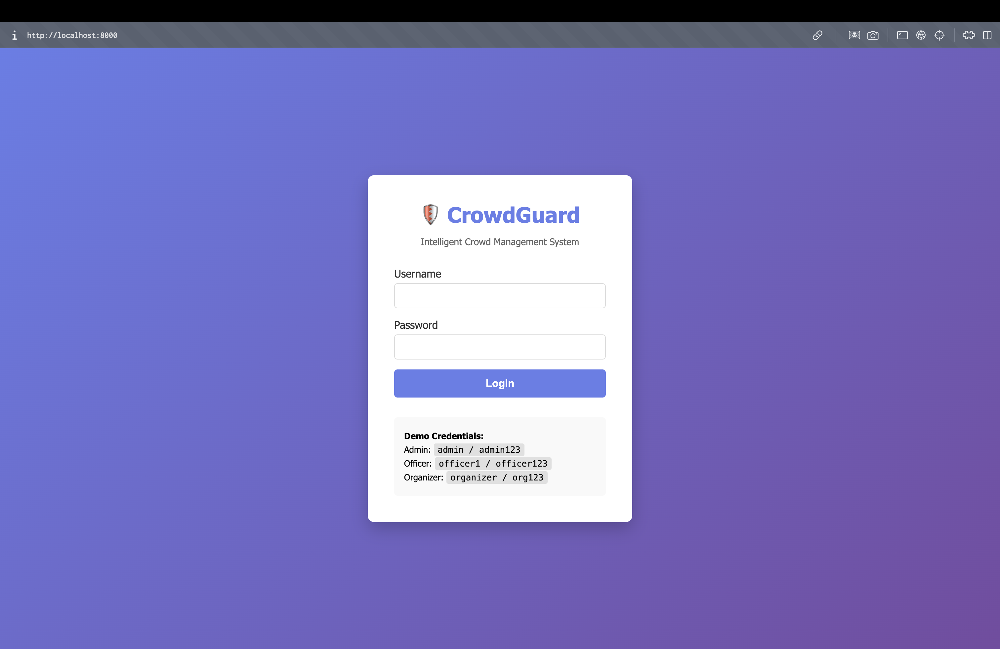
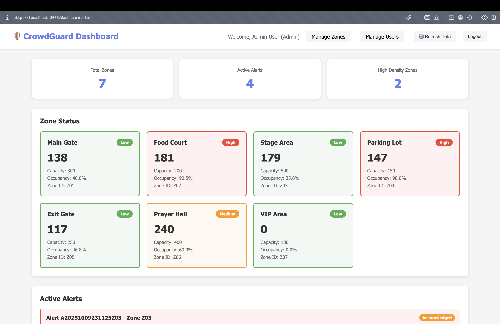
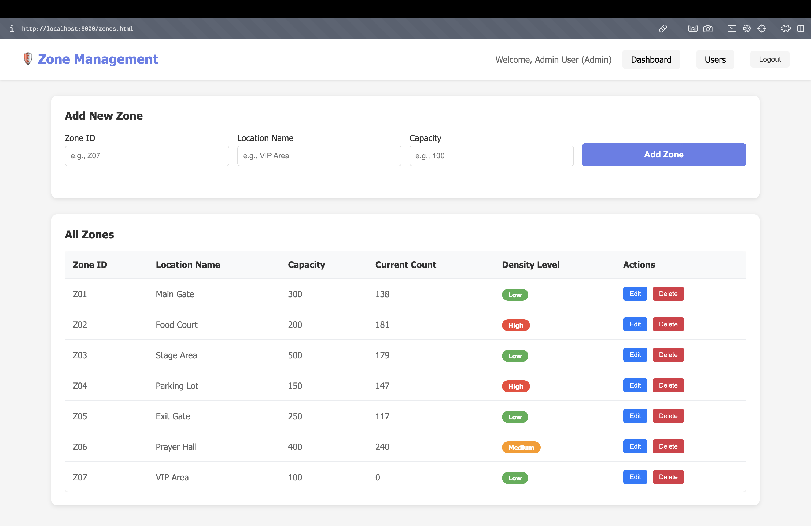
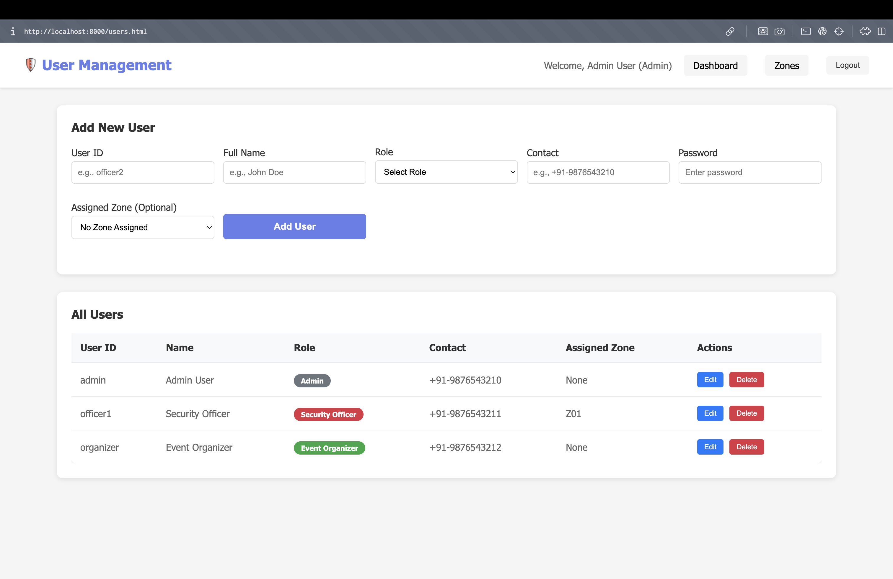
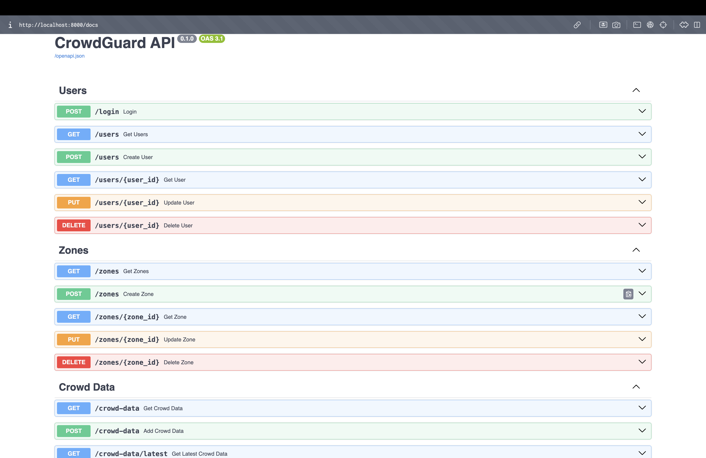

# CrowdGuard: Intelligent Crowd Management System

A real-time crowd management system built with Python FastAPI, MongoDB, and vanilla HTML/CSS/JavaScript for monitoring crowd density and managing alerts at public events.

## 🎯 Project Overview

CrowdGuard demonstrates a practical implementation of MongoDB for managing real-time crowd data, alerts, and event logs. The system simulates crowd monitoring across multiple zones and automatically generates alerts when density thresholds are exceeded.

## 🏗️ System Architecture

### Backend (Python FastAPI)
- **FastAPI**: RESTful API endpoints
- **Motor**: Async MongoDB driver
- **Pydantic**: Data validation and modeling

### Database (MongoDB)
- **Collections**: users, zones, crowd_data, alerts, logs
- **Features**: Document storage, aggregation pipelines, time-series data

### Frontend (Vanilla JS)
- **HTML5/CSS3**: Modern responsive design
- **JavaScript**: Real-time data fetching and updates

## 📁 Project Structure

```
parnika_dbms/
├── backend/
│   ├── main.py                 # FastAPI application entry point
│   ├── database.py             # MongoDB connection setup
│   ├── models.py               # Pydantic data models
│   ├── routes/
│   │   ├── users.py           # User authentication endpoints
│   │   ├── zones.py           # Zone management endpoints
│   │   ├── crowd_data.py      # Crowd data endpoints
│   │   └── alerts.py          # Alert management endpoints
│   ├── seed_data.py           # Database seeding script
│   └── mock_data.py           # Mock data generator
├── frontend/
│   ├── index.html             # Login page
│   ├── dashboard.html         # Main dashboard
│   ├── css/
│   │   └── style.css          # Styles
│   └── js/
│       └── script.js          # Dashboard logic
├── requirements.txt
└── README.md
```

## 🚀 Setup Instructions

### Prerequisites
- Python 3.10 or higher
- [uv](https://github.com/astral-sh/uv) (recommended) or pip
- MongoDB installed locally OR MongoDB Atlas account

### Step 1: Install MongoDB

**For macOS:**
```bash
brew tap mongodb/brew
brew install mongodb-community
brew services start mongodb-community
```

**For Ubuntu/Debian:**
```bash
sudo apt-get install mongodb
sudo systemctl start mongodb
```

**Or use MongoDB Atlas** (free cloud option):
1. Sign up at https://www.mongodb.com/cloud/atlas
2. Create a free cluster
3. Get your connection string
4. Set environment variable: `export MONGO_URL="your_connection_string"`

### Step 2: Install Python Dependencies (with uv)

```bash
# Install uv if needed: brew install uv
uv sync
```

Or with pip: `pip install -r requirements.txt` (use a venv).

### Step 3: Seed the Database

```bash
uv run python -m backend.seed_data
# or: python -m backend.seed_data (if using pip/venv)
```

This will create:
- 3 demo users (Admin, Security Officer, Event Organizer)
- 6 zones (Main Gate, Food Court, Stage Area, etc.)
- Sample crowd data and alerts

### Step 4: Run the Backend Server

```bash
uv run uvicorn backend.main:app --reload
```

Or use the start script: `./start.sh`

The API will be available at: http://localhost:8000

### Step 5: Run Mock Data Generator (Optional)

In a separate terminal:
```bash
uv run python -m backend.mock_data
```

Or use `./start_with_mock.sh` to run server and mock data together.

This simulates real-time crowd data updates every 10 seconds.

### Step 6: Access the Dashboard

Open your browser and navigate to:
```
http://localhost:8000/index.html
```

## 📸 Screenshots

| Sign In | Main Dashboard |
|---------|----------------|
|  |  |

| Zones Management | Users Management |
|------------------|-------------------|
|  |  |

| API Documentation |
|--------------------|
|  |

## 🔐 Demo Credentials

| Role             | Username  | Password   |
|------------------|-----------|------------|
| Admin            | admin     | admin123   |
| Security Officer | officer1  | officer123 |
| Event Organizer  | organizer | org123     |

## 📊 Features

### Dashboard Features
- **Real-time Zone Monitoring**: View current crowd count and density for each zone
- **Color-coded Alerts**: Visual indicators for Low (Green), Medium (Yellow), High (Red) density
- **Alert Management**: Acknowledge and resolve alerts
- **Activity Logs**: Track all system actions and user activities
- **Manual Refresh**: Dashboard updates on demand (no auto-refresh)
- **Navigation**: Easy access to Zone and User management pages

### Zone Management (CRUD Operations)
- **Create**: Add new zones with ID, location name, and capacity
- **Read**: View all zones with current crowd data and density levels
- **Update**: Edit zone details (location name, capacity)
- **Delete**: Remove zones from the system
- **Real-time Data**: Shows current crowd count and density for each zone

### User Management (CRUD Operations)
- **Create**: Add new users with roles (Admin, Security Officer, Event Organizer)
- **Read**: View all users with their roles and assigned zones
- **Update**: Edit user details (name, role, contact, assigned zone, password)
- **Delete**: Remove users from the system
- **Role-based Access**: Different user roles with appropriate permissions

### API Endpoints

#### Authentication
- `POST /login` - User login

#### Zones (Full CRUD)
- `GET /zones` - Get all zones
- `GET /zones/{zone_id}` - Get specific zone
- `POST /zones` - Create new zone
- `PUT /zones/{zone_id}` - Update zone
- `DELETE /zones/{zone_id}` - Delete zone

#### Users (Full CRUD)
- `GET /users` - Get all users
- `GET /users/{user_id}` - Get specific user
- `POST /users` - Create new user
- `PUT /users/{user_id}` - Update user
- `DELETE /users/{user_id}` - Delete user

#### Crowd Data
- `GET /crowd-data` - Get crowd data (optional: filter by zone_id)
- `GET /crowd-data/latest` - Get latest data for all zones
- `POST /crowd-data` - Add new crowd data

#### Alerts
- `GET /alerts` - Get alerts (optional: filter by status)
- `POST /alerts` - Create new alert
- `PUT /alerts/{alert_id}` - Update alert status

#### Logs
- `GET /api/logs` - Get activity logs

## 🗄️ MongoDB Collections

### Users Collection
```json
{
  "user_id": "admin",
  "name": "Admin User",
  "role": "Admin",
  "contact": "+91-9876543210",
  "zone_assigned": null,
  "password": "admin123"
}
```

### Zones Collection
```json
{
  "zone_id": "Z01",
  "location_name": "Main Gate",
  "capacity": 300
}
```

### Crowd Data Collection
```json
{
  "zone_id": "Z01",
  "timestamp": "2025-10-09T10:45:00Z",
  "people_count": 285,
  "density_level": "High"
}
```

### Alerts Collection
```json
{
  "alert_id": "A001",
  "zone_id": "Z03",
  "severity": "High",
  "time": "2025-10-09T10:45:00Z",
  "status": "Active",
  "responder": null
}
```

### Logs Collection
```json
{
  "log_id": "LOG001",
  "action": "System initialized",
  "performed_by": "System",
  "timestamp": "2025-10-09T08:00:00Z"
}
```

## 🎓 MongoDB Features Demonstrated

1. **Document-based Storage**: Flexible schema for different data types
2. **Aggregation Pipeline**: Used in `/crowd-data/latest` endpoint to get recent data per zone
3. **Time-series Data**: Efficient storage of timestamped crowd data
4. **Indexing**: Implicit indexes on timestamp and zone_id for faster queries
5. **CRUD Operations**: Complete Create, Read, Update operations

## 🔧 Configuration

### Environment Variables
- `MONGO_URL`: MongoDB connection string (default: `mongodb://localhost:27017`)

Create a `.env` file in the project root:
```
MONGO_URL=mongodb://localhost:27017
```

## 📝 API Documentation

Once the server is running, visit:
```
http://localhost:8000/docs
```

FastAPI automatically generates interactive API documentation (Swagger UI).

## 🧪 Testing the System

1. **Login** with any demo credentials
2. **View Zones** - See current crowd levels
3. **Monitor Alerts** - Active alerts appear in the alerts section
4. **Acknowledge/Resolve Alerts** - Click buttons to update alert status
5. **Check Logs** - View recent system activities
6. **Watch Real-time Updates** - Dashboard refreshes automatically

## 📈 Sample Use Cases

1. **Kumbh Mela Crowd Management**: Monitor different ghats and bathing areas
2. **Concert/Festival Events**: Track entry gates, food courts, and stages
3. **Shopping Mall**: Monitor parking lots, entrances, and food courts
4. **Stadium Events**: Track different seating sections and exit gates

## 🛠️ Troubleshooting

**Issue: Connection error**
- Make sure MongoDB is running: `brew services list` (macOS) or `sudo systemctl status mongodb` (Linux)
- Check if port 27017 is available

**Issue: Backend not starting**
- Ensure all dependencies are installed: `pip install -r requirements.txt`
- Check Python version: `python --version` (should be 3.8+)

**Issue: Frontend not loading**
- Make sure backend is running on port 8000
- Check browser console for errors
- Try accessing http://localhost:8000/docs to verify API is running

## 👥 Contributors

- Pranav Prajapati
- B.Tech 3rd Year - DBMS Project

## 📄 License

This project is created for academic purposes.

## 🙏 Acknowledgments

- MongoDB for the database system
- FastAPI for the backend framework
- Modern web technologies for the frontend

---

**Note**: This is a demonstration project for academic submission. For production use, implement proper authentication, error handling, and security measures.


